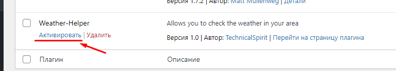
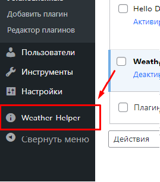

# About the plugin

This is a regular plugin for Wordpress that adds a visual element to
page design.

This element will display the client's city and the current temperature there

# How to work with this plugin?

After activating the plugin

Its sign will appear in the menu on the left

There will be two pages in the sub-items of this menu

The main page will display the last 5 calls to the Open Weather API

The number of displayed elements is determined by the "request_history_length" variable in the weather-helper/config.php plugin file

On the plugin settings page you will need to enter the api key from the Open Weather API and send this data

Afterwards you will need to go to the page editor and select the "Block Weather Helper" element

After dragging it onto the page it will look like this.

After you save the changes to the page and go to it, you will get this result.

